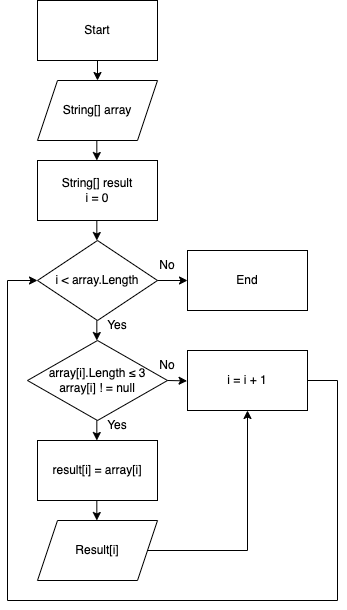

## Итоговая проверочная работа 
### Задача
Написать программу, которая из имеющегося массива строк формирует массив из строк, длина которых меньше либо равна 3 символам. Первоначальный массив можно ввести с клавиатуры либо задать на старте выполнения алгоритма. 
### Алгоритм решения задачи 

### Описание решения задачи 
- массив строк задается пользователем через пробел; 
- массив заполняется с исключением значения null;
- строка делится на подстроки;
- задается массив для вывода результата; 
- в цикле задается два условия: максимальная длина строки в три символа включительно и отсутствие пустого значения у элемента строки; 
- если условия выполняются, текущий индекс массива присваивается индексу массива для вывода результата; 
- цикл начинается с индекса 0 и выполняется с увеличением индекса на 1 до тех пор, пока индекс элемента массива меньше длины заданного пользователем массива; 
- результат выводится в виде массива строк с длиной меньшей или равной трем символам. 